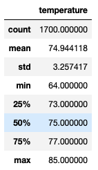
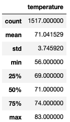

# Surf's Up!

## Overview
After putting together a business proposal and saving up a bit of money for the surf and ice cream shop we are hoping to build in Hawaii, we need to put together more information to present to our prospective investor, W. Avy. So far, he is very interested, but wants to ensure that the weather, specifically the temperatures, in Hawaii are conducive to operating such a business year round. To do so, W. Avy wants to know the temperatures in Hawaii in both June and December to judge the highs and lows for the years before making a decision on his investment.

## Analysis
- One key difference between the temperatures in Hawaii in June and December is the volatility and temperature ranges. In June, we recorded 1700 temps ranging from 64 to 85 degrees with a standard deviation of 3.26 (top chart image below), whereas in the 1517 temps collected in December ranged from 56 to 83, with a std dev of 3.71 (bottom chart image below). This shows us that Decemver has a wider range of outcomes and the weather is a little more variable in the winter months.

 June

 December

- Another major difference between the two months is the minimum/low temps. In June, the lowest recorded temperature was 64, whereas the lowest in December was 56 degrees (see charts above). So the lows in December clearly are a bit lower than June.
-Finally, the average temperatures in the two months also differ. June's average temperature is about 75 degrees, while December is at 71. Although it may not be major, we still see a 4 degree difference.

## Summary
From this analysis, we can deduce that Hawaii would be a favorable location to operate a surf and ice cream shop year-round. In the warmest and coldest months of the year, Hawaii still boasts temperatures in the 70s on average, which is plenty warm to enjoy some surfing, as well as some ice cream. To further strengthen our analysis, however, there are a couple additional queries we could perform. First, we could check the temperatures by station to see which locales are most advantageous for the surf and ice cream shop. To do so, we could add additional pieces to our query to add the stations in addition to the dates and temps to perhaps target the warmest areas to put up shop. Additionally, we could add precipitation to our query to see which stations have the least amount of precipitation. The best place to have a surf and ice cream shop is where it is warmest and rains the least so more people want to enjoy the nice weather in the water without the threat of a storm and can cool off with some ice cream after a hot day on the beach.
